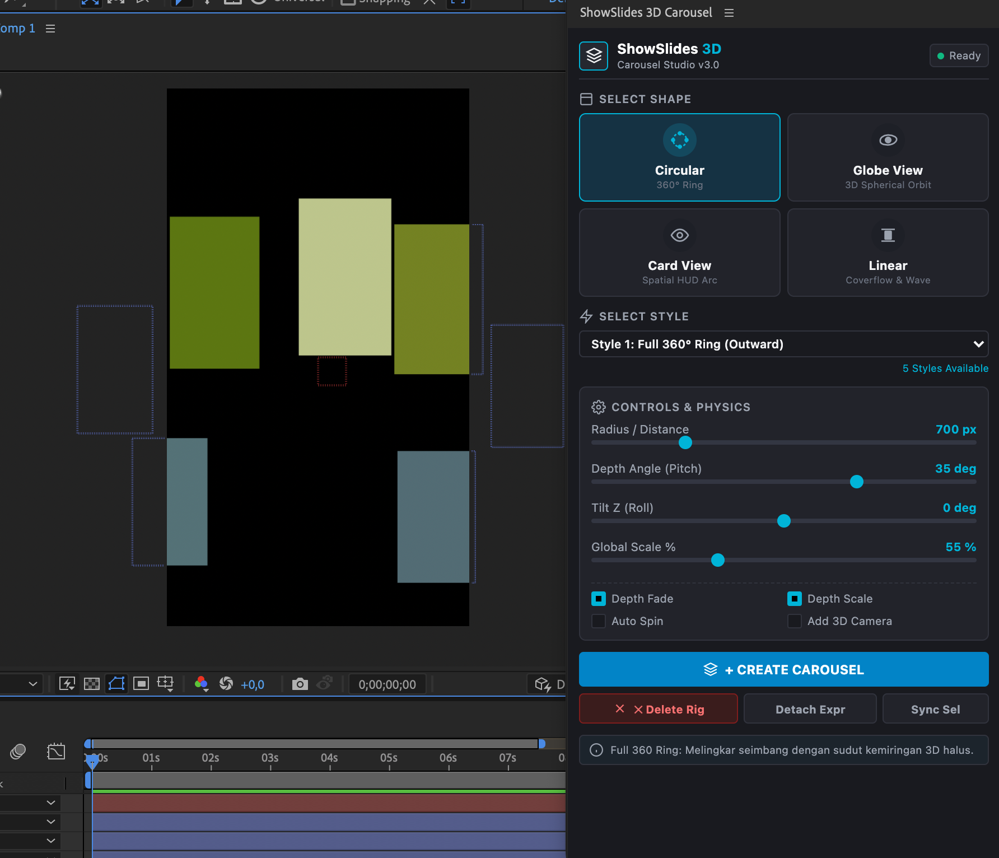
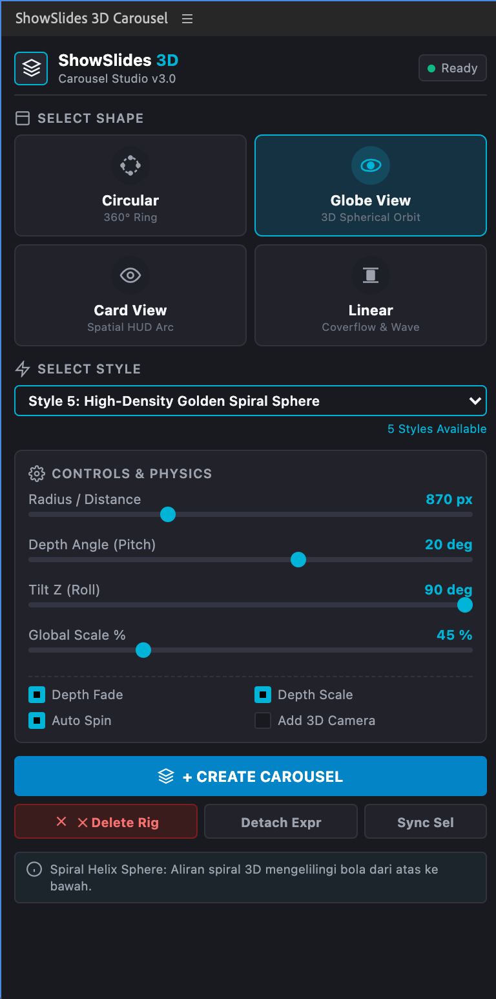

# ShowSlides 3D Carousel Studio (v3.0)

  

  <b>Professional Adobe After Effects Plugin & Extension</b> 
  Generate high-end dynamic 3D Carousel animations instantly with <b>4 Base Shapes</b> and <b>20 Production Styles</b>. 
  <i>Compatible with Adobe After Effects CC 2020 – 2025+ (Windows & macOS)</i>

  <a href="#english">🇬🇧 English</a> • <a href="#bahasa-indonesia">🇮🇩 Bahasa Indonesia</a> • <a href="#-installation-panduan-instalasi">🚀 Installation</a> • <a href="#-releases--downloads">📦 Downloads</a>

---

## 🇬🇧 English Documentation

### 📸 Screenshots & Workflow Preview

  

  

ShowSlides is crafted with a lightweight, responsive, and flat modern dark UI. It operates instantaneously without bulky dependencies.

---

### 💎 Architecture: 4 Base Shapes & 20 Carousel Styles

ShowSlides streamlines carousel generation into 2 effortless steps:
1. **Select Shape** (Choose the base geometric shape: *Circular*, *Globe View*, *Card View*, *Linear*)
2. **Select Style** (Choose from 5 physics presets tailored for each shape)

---

#### 1. ⭕ Circular (Radial 360° Ring)
Symmetrical circular arrangement with 3D inclination tilt and depth scaling.

| Style | Preset Name | Motion Physics & Characteristics |
| :--- | :--- | :--- |
| **Style 1** | Full 360° Ring (Outward) | Full $360^\circ$ radial ring with a subtle $35^\circ$ depth tilt. Front cards remain crisp and prominent while distant cards scale down gracefully. |
| **Style 2** | 3D Inclined Orbit Ring | Inclined orbital ring ($45^\circ$ tilt) with dynamic tangential card orientation along the curved path. |
| **Style 3** | High-Speed Centered Spiral | Rapid circular rotation with vertical spiral elevation stepped along the Y axis. |
| **Style 4** | Extreme Tilt Vertical Wheel | Sharp vertical tilt ($75^\circ$) rotating dynamically like an animated vertical Ferris wheel. |
| **Style 5** | Deep Perspective Vortex | Circular vortex with dramatic perspective depth ($65^\circ$ tilt) and pronounced z-depth scale modulation. |

---

#### 2. 🌐 Globe View (True 3D Spherical Orbit)
True 3D spherical geometry where elements orbit smoothly across spherical latitudes and longitudes.

| Style | Preset Name | Motion Physics & Characteristics |
| :--- | :--- | :--- |
| **Style 1** | Standard 3D Orbit Globe | Uniformly distributed across the spherical surface via the *Golden Ratio Fibonacci Lattice* with depth scaling. |
| **Style 2** | Polar Orbital Meridian | Vertical polar meridian ring revolving around the central 3D core ($Tilt\ Z = 90^\circ$). |
| **Style 3** | Tilted Latitude Spherical Band | Multi-tiered latitude bands (Equator and Polar Tropics) with $-28^\circ$ pitch inclination. |
| **Style 4** | Planetary Saturn Ring | Cosmic orbital ring with dynamic harmonic wave modulation surrounding the gravitational center. |
| **Style 5** | High-Density Golden Spiral Sphere | Continuous 3D helical spiral wrapping around the sphere from the top pole to the bottom pole. |

---

#### 3. 🗂️ Card View (Spatial HUD — Vision Pro Style)
Floating spatial cards flanking inward toward the viewer, optimized for modern UI/UX showcases.

| Style | Preset Name | Motion Physics & Characteristics |
| :--- | :--- | :--- |
| **Style 1** | Spatial HUD Arc (Wide Angle) | Subtle inward curved layout ($-70^\circ$ inward flank) with the active center card dominating the frame. |
| **Style 2** | Deep Wrap-Around HUD (120° Flank) | Wide-angle wrapping wings ($-110^\circ$ flank) enveloping the viewport for an immersive spatial feel. |
| **Style 3** | Floating Tiered Spatial Stage | Tiered spatial stage featuring progressive Y-axis vertical elevation. |
| **Style 4** | Compact Focus Card Rack | Compact card rack with tight horizontal spacing and seamless slide transitions. |
| **Style 5** | High-Speed Glide HUD | High-velocity horizontal glide transition between cards with smooth depth perspective. |

---

#### 4. 〰️ Linear (3D Coverflow, Wave & Runway Flow)
Non-circular parametric pathways designed for sequential timeline showcases.

| Style | Preset Name | Motion Physics & Characteristics |
| :--- | :--- | :--- |
| **Style 1** | S-Curve Wave Runway | Sinusoidal S-curve wave flow gliding across 3D space. |
| **Style 2** | 3D Coverflow Runway | Classic horizontal Coverflow with inward V-Shape card angles. |
| **Style 3** | Ascending Staircase Runway | Diagonal staircase path ascending from bottom-left to top-right. |
| **Style 4** | Serpentine S-Flow Wave | Sharp serpentine path with responsive dynamic Z-depth modulation. |
| **Style 5** | Cascading Waterfall Runway | Vertical waterfall cascade descending from the top into the background depth. |

---

### ⚙️ Master Controls (`ShowSlides_Controller`)

Every rig is governed by a single 3D Null Layer equipped with non-destructive Effect Controls:

* **Move Carousel:** Master slider for scrubbing card position/rotation along the track (keyframeable & loop-ready).
* **Speed:** Continuous time-driven auto-spin speed multiplier (`time * Speed`).
* **Radius / Distance:** Overall radius or track length dimensions.
* **Depth Angle / Tilt X:** Vertical 3D elevation pitch angle.
* **Tilt Z:** Lateral roll rotation angle.
* **Global Scale %:** Base card scale (defaults to 45%–75% for balanced proportions without distortion).
* **Scale Depth % & Scale Min %:** Dynamic Z-depth scaling (foreground cards stay sharp, background cards recede gracefully).
* **Depth Fade %:** Smooth opacity falloff on cards receding into the distance.
* **3D Y Angle:** Inward flanking angle for Card View spatial mode.

---

## 🇮🇩 Dokumentasi Bahasa Indonesia

### 📸 Tampilan Screenshot & Workflow

  

  

ShowSlides dirancang dengan antarmuka modern yang cepat, responsif, dan ringan tanpa dependensi berat.

---

### 💎 Arsitektur: 4 Base Shapes & 20 Carousel Styles

ShowSlides membagi alur kerja pembuatan carousel menjadi 2 langkah mudah:
1. **Select Shape** (Pilih bentuk geometri dasar: *Circular*, *Globe View*, *Card View*, *Linear*)
2. **Select Style** (Pilih variasi style & physics yang diinginkan — 5 Style per Shape)

---

#### 1. ⭕ Circular (Radial 360° Ring)
Susunan melingkar simetris di sekitar sumbu rotasi dengan depth scaling dan sudut kemiringan 3D.

| Style | Nama Preset | Karakteristik & Motion Physics |
| :--- | :--- | :--- |
| **Style 1** | Full 360° Ring (Outward) | Melingkar penuh $360^\circ$ dengan kemiringan halus $35^\circ$, kartu di depan besar & tajam, kartu belakang mengecil anggun. |
| **Style 2** | 3D Inclined Orbit Ring | Cincin orbit miring ($45^\circ$) dengan rotasi tangensial dinamis mengikuti lintasan kurva. |
| **Style 3** | High-Speed Centered Spiral | Melingkar berkecepatan tinggi dengan elevasi spiral vertikal terpusat ke titik tengah. |
| **Style 4** | Extreme Tilt Vertical Wheel | Kemiringan vertikal tajam ($75^\circ$) berputar layaknya roda vertikal dinamis. |
| **Style 5** | Deep Perspective Vortex | Pusaran melingkar dengan kedalaman perspektif intens ($65^\circ$ tilt) dan scaling kedalaman dramatis. |

---

#### 2. 🌐 Globe View (True 3D Spherical Orbit)
Susunan 3D bola (*sphere*) sejati di mana elemen terdistribusi melengkung mengelilingi seluruh permukaan bola 3D.

| Style | Nama Preset | Karakteristik & Motion Physics |
| :--- | :--- | :--- |
| **Style 1** | Standard 3D Orbit Globe | Distribusi merata ke seluruh permukaan bola 3D via *Golden Ratio Fibonacci Lattice* mengitari inti 3D. |
| **Style 2** | Polar Orbital Meridian | Garis bujur kutub vertikal berputar mengitari inti bola 3D ($Tilt\ Z = 90^\circ$). |
| **Style 3** | Tilted Latitude Spherical Band | Susunan 3 sabuk garis lintang (Khatulistiwa dan Kutub) dengan kemiringan pitch $-28^\circ$. |
| **Style 4** | Planetary Saturn Ring | Cincin orbit planet miring dengan gelombang dinamis mengelilingi pusat gravitasi. |
| **Style 5** | High-Density Golden Spiral Sphere | Aliran heliks spiral 3D mengelilingi bola dari kutub atas ke bawah secara kontinu. |

---

#### 3. 🗂️ Card View (Apple Vision Spatial HUD)
Susunan kartu spatial mengambang melengkung ke dalam di depan pandangan penonton.

| Style | Nama Preset | Karakteristik & Motion Physics |
| :--- | :--- | :--- |
| **Style 1** | Spatial HUD Arc (Wide Angle) | Lengkungan kartu spatial melengkung ke dalam ($-70^\circ$ inward flank) dengan kartu aktif dominan di tengah layar. |
| **Style 2** | Deep Wrap-Around HUD (120° Flank) | Sudut lengkungan sayap samping tajam ($-110^\circ$) membungkus viewport secara sinematik. |
| **Style 3** | Floating Tiered Spatial Stage | Panggung spasial bertingkat dengan variasi elevasi vertikal sumbu Y. |
| **Style 4** | Compact Focus Card Rack | Rak kartu rapat terfokus dengan transisi slide halus antar kartu saat di-scrub. |
| **Style 5** | High-Speed Glide HUD | Transisi meluncur cepat antar kartu horizontal dengan kedalaman halus. |

---

#### 4. 〰️ Linear (3D Coverflow, Wave & Runway Flow)
Susunan lintasan alur non-lingkaran untuk presentasi kartu berurutan.

| Style | Nama Preset | Karakteristik & Motion Physics |
| :--- | :--- | :--- |
| **Style 1** | S-Curve Wave Runway | Aliran kurva gelombang sinusoidal melintasi layar dalam ruang 3D. |
| **Style 2** | 3D Coverflow Runway | Aliran horizontal klasik dengan orientasi sirip V-Shape menghadap ke pusat. |
| **Style 3** | Ascending Staircase Runway | Tangga bertingkat diagonal naik dari kiri-bawah meluncur ke kanan-atas. |
| **Style 4** | Serpentine S-Flow Wave | Jalur berkelok tajam dengan kedalaman Z dinamis. |
| **Style 5** | Cascading Waterfall Runway | Aliran vertikal meluncur dari atas ke latar belakang. |

---

### ⚙️ Kontrol Lengkap di `ShowSlides_Controller`

* **Move Carousel:** Kontrol master untuk menganimasikan posisi/putaran kartu di sepanjang lintasan (support keyframe & auto-spin).
* **Speed:** Kecepatan rotasi/gerak otomatis berbasis waktu (`time * Speed`).
* **Radius / Distance:** Mengatur dimensi radius lingkaran/bola atau jarak lintasan.
* **Depth Angle / Tilt X:** Sudut elevasi kemiringan vertikal 3D.
* **Tilt Z:** Sudut putaran roll lateral.
* **Global Scale %:** Skala dasar kartu (default 45%–75% untuk proporsi kartu yang pas tanpa distorsi).
* **Scale Depth % & Scale Min %:** Modulasi skala berbasis kedalaman Z (kartu depan besar & jelas, kartu belakang mengecil).
* **Depth Fade %:** Transparansi kedalaman halus pada kartu yang berada di latar belakang.
* **3D Y Angle:** Sudut lengkung sayap kartu ke dalam pada mode Card View.

---

## 🚀 Installation / Panduan Instalasi

### Option A: ScriptUI Panel (Recommended / Paling Mudah)
1. Copy `ShowSlides_Carousel.jsx`.
2. Paste into After Effects ScriptUI Panels directory:
   * **Windows:** `C:\Program Files\Adobe\Adobe After Effects <Version>\Support Files\Scripts\ScriptUI Panels\`
   * **macOS:** `/Applications/Adobe After Effects <Version>/Scripts/ScriptUI Panels/`
3. Restart After Effects (or refresh Window menu).
4. Open **Window > ShowSlides_Carousel.jsx**.

### Option B: Adobe CEP Extension
1. Enable Adobe CEP PlayerDebugMode:
   * **Windows (CMD as Admin):** `reg add "HKEY_CURRENT_USER\Software\Adobe\CSXS.9" /v PlayerDebugMode /t REG_SZ /d 1 /f`
   * **macOS (Terminal):** `defaults write com.adobe.CSXS.9 PlayerDebugMode 1`
2. Copy the `showslides-cep` directory into:
   * **Windows:** `C:\Program Files (x86)\Common Files\Adobe\CEP\extensions\showslides-cep`
   * **macOS:** `/Library/Application Support/Adobe/CEP/extensions/showslides-cep`
3. Open in After Effects: **Window > Extensions > ShowSlides 3D Carousel**.

---

## 📦 Releases & Downloads

Ready-to-use zip packages are available under GitHub Releases:
* **[ShowSlides-3D-Carousel-Studio-v3.0.zip](https://github.com/keliksa30/showslides/releases)**

---

## 📄 License
MIT License © 2026 keliksa30.
