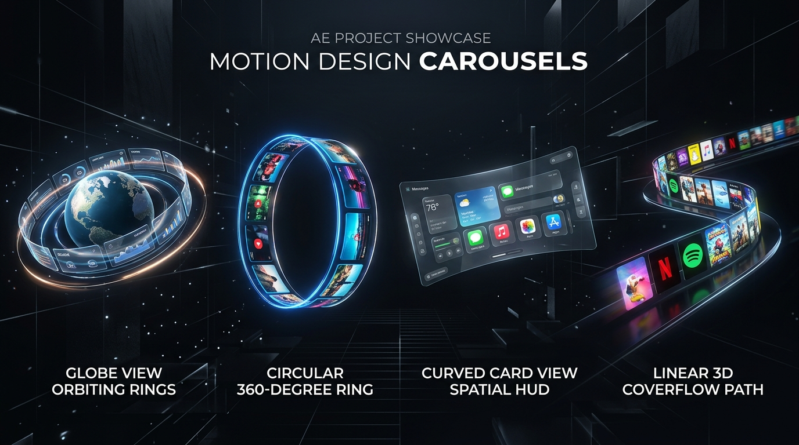
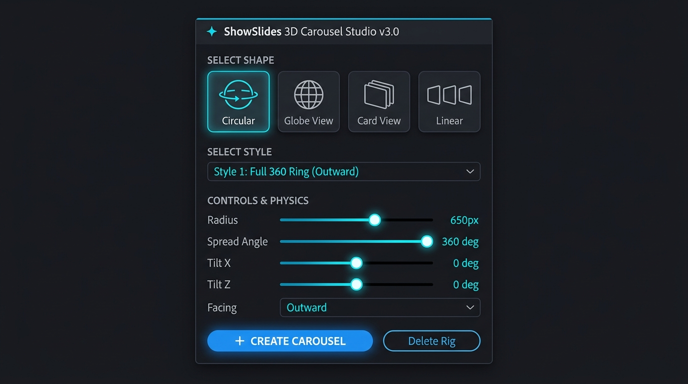

# ShowSlides 3D Carousel Studio (v3.0)

> Plugin & Extension After Effects profesional untuk membuat animasi 3D Carousel dinamis secara instan dengan **4 Base Shapes** dan **20 Preset Styles**.

---

---

## 📸 Antarmuka Panel UI

ShowSlides dirancang dengan antarmuka modern yang cepat, responsif, dan ringan tanpa dependensi berat.

---

## 💎 Arsitektur 4 Base Shapes & 20 Carousel Styles

ShowSlides membagi alur kerja pembuatan carousel menjadi 2 langkah mudah:
1. **Select Shape** (Pilih bentuk geometri dasar: *Circular*, *Globe View*, *Card View*, *Linear*)
2. **Select Style** (Pilih variasi style & physics yang diinginkan — 5 Style per Shape)

---

### 1. ⭕ Circular (Radial 360° Ring)
Susunan melingkar simetris di sekitar sumbu rotasi dengan depth scaling dan sudut kemiringan 3D.

| Style | Nama Preset | Karakteristik & Motion Physics |
| :--- | :--- | :--- |
| **Style 1** | Full 360° Ring (Outward) | Melingkar penuh $360^\circ$ dengan kemiringan halus $35^\circ$, kartu di depan besar & tajam, kartu di belakang mengecil anggun. |
| **Style 2** | 3D Inclined Orbit Ring | Cincin orbit miring ($45^\circ$) dengan rotasi tangensial dinamis mengikuti lintasan kurva. |
| **Style 3** | High-Speed Centered Spiral | Melingkar berkecepatan tinggi dengan elevasi spiral vertikal terpusat ke titik tengah. |
| **Style 4** | Extreme Tilt Vertical Wheel | Kemiringan vertikal tajam ($75^\circ$) berputar layaknya roda vertikal dinamis. |
| **Style 5** | Deep Perspective Vortex | Pusaran melingkar dengan kedalaman perspektif intens ($65^\circ$ tilt) dan scaling kedalaman dramatis. |

---

### 2. 🌐 Globe View (True 3D Spherical Orbit)
Susunan 3D bola (*sphere*) di mana elemen terdistribusi melengkung mengelilingi seluruh permukaan bola 3D.

| Style | Nama Preset | Karakteristik & Motion Physics |
| :--- | :--- | :--- |
| **Style 1** | Standard 3D Orbit Globe | Distribusi merata ke seluruh permukaan bola 3D via *Golden Ratio Fibonacci Lattice*. Kartu mengitari bola dengan depth scaling otomatis. |
| **Style 2** | Polar Orbital Meridian | Garis bujur kutub vertikal berputar mengitari inti bola 3D. |
| **Style 3** | Tilted Latitude Spherical Band | Susunan 3 sabuk garis lintang (Khatulistiwa dan Kutub) dengan kemiringan pitch $-28^\circ$. |
| **Style 4** | Planetary Saturn Ring | Cincin orbit planet miring dengan gelombang dinamis mengelilingi pusat gravitasi. |
| **Style 5** | High-Density Golden Spiral Sphere | Aliran heliks spiral 3D mengelilingi bola dari kutub atas ke bawah secara kontinu. |

---

### 3. 🗂️ Card View (Apple Vision Spatial HUD)
Susunan kartu spatial mengambang melengkung ke dalam di depan pandangan penonton.

| Style | Nama Preset | Karakteristik & Motion Physics |
| :--- | :--- | :--- |
| **Style 1** | Spatial HUD Arc (Wide Angle) | Lengkungan kartu melengkung ke dalam ($-70^\circ$ inward flank) dengan kartu aktif dominan di tengah layar. |
| **Style 2** | Deep Wrap-Around HUD (120° Flank) | Sudut lengkungan sayap samping tajam ($-110^\circ$) membungkus viewport secara sinematik. |
| **Style 3** | Floating Tiered Spatial Stage | Panggung spasial bertingkat dengan variasi elevasi vertikal sumbu Y. |
| **Style 4** | Compact Focus Card Rack | Rak kartu rapat terfokus dengan transisi slide halus antar kartu saat di-scrub. |
| **Style 5** | High-Speed Glide HUD | Transisi meluncur cepat antar kartu horizontal dengan kedalaman halus. |

---

### 4. 〰️ Linear (3D Coverflow, Wave & Runway Flow)
Susunan lintasan alur non-lingkaran untuk presentasi kartu berurutan.

| Style | Nama Preset | Karakteristik & Motion Physics |
| :--- | :--- | :--- |
| **Style 1** | S-Curve Wave Runway | Aliran kurva gelombang sinusoidal melintasi layar dalam ruang 3D. |
| **Style 2** | 3D Coverflow Runway | Aliran horizontal klasik dengan orientasi sirip V-Shape menghadap ke pusat. |
| **Style 3** | Ascending Staircase Runway | Tangga bertingkat diagonal naik dari kiri-bawah meluncur ke kanan-atas. |
| **Style 4** | Serpentine S-Flow Wave | Jalur berkelok tajam dengan kedalaman kedalaman Z dinamis. |
| **Style 5** | Cascading Waterfall Runway | Aliran vertikal meluncur dari atas ke latar belakang. |

---

## ⚙️ Kontrol Lengkap di `ShowSlides_Controller`

Setiap rig carousel dikendalikan oleh satu Null Layer 3D dengan kontrol Effect yang lengkap & responsif:

* **Move Carousel:** Kontrol master untuk menganimasikan posisi/putaran kartu di sepanjang lintasan (support keyframe & auto-spin).
* **Speed:** Kecepatan rotasi/gerak otomatis berbasis waktu (`time * Speed`).
* **Radius / Distance:** Mengatur dimensi radius lingkaran/bola atau jarak lintasan.
* **Depth Angle / Tilt X:** Sudut elevasi kemiringan vertikal 3D.
* **Tilt Z:** Sudut putaran roll lateral.
* **Global Scale %:** Skala dasar kartu (default 45-75% untuk proporsi kartu yang pas tanpa distorsi).
* **Scale Depth % & Scale Min %:** Modulasi skala berbasis kedalaman Z (kartu depan besar & jelas, kartu belakang mengecil).
* **Depth Fade %:** Transparansi kedalaman halus pada kartu yang berada di latar belakang.
* **3D Y Angle:** Sudut lengkung sayap kartu ke dalam pada mode Card View.

---

## 📦 File Tersedia

### 1. ScriptUI Panel (Paling Mudah & Siap Pakai)
File: [ShowSlides_Carousel.jsx](file:///home/ubuntu/showslides/ShowSlides_Carousel.jsx)
* Panel bawaan After Effects dengan flat dark UI, icon vector, dan performa instan.
* Bekerja di After Effects CC 2020 hingga versi terbaru (2024 / 2025+).

### 2. Adobe CEP Extension (Modern HTML Panel)
Folder: [showslides-cep/](file:///home/ubuntu/showslides/showslides-cep)
* Tampilan modern berbasis HTML/CSS dengan pemilih visual 4 Shapes, dropdown 20 Style, slider kontrol, dan tombol Delete/Detach Rig.

---

## 🚀 Cara Instalasi

### Metode A: ScriptUI Panel (Rekomendasi)
1. Salin file [ShowSlides_Carousel.jsx](file:///home/ubuntu/showslides/ShowSlides_Carousel.jsx).
2. Tempel ke folder ScriptUI Panels After Effects komputer Anda:
   * **Windows:** `C:\Program Files\Adobe\Adobe After Effects <Versi>\Support Files\Scripts\ScriptUI Panels\`
   * **macOS:** `/Applications/Adobe After Effects <Versi>/Scripts/ScriptUI Panels/`
3. Restart After Effects (atau refresh menu Window).
4. Buka menu **Window > ShowSlides_Carousel.jsx**.

### Metode B: Adobe CEP Extension
1. Aktifkan mode developer Adobe CEP:
   * **Windows (CMD):** `reg add "HKEY_CURRENT_USER\Software\Adobe\CSXS.9" /v PlayerDebugMode /t REG_SZ /d 1 /f`
   * **macOS (Terminal):** `defaults write com.adobe.CSXS.9 PlayerDebugMode 1`
2. Salin folder `showslides-cep` ke direktori extensions:
   * **Windows:** `C:\Program Files (x86)\Common Files\Adobe\CEP\extensions\showslides-cep`
   * **macOS:** `/Library/Application Support/Adobe/CEP/extensions/showslides-cep`
3. Buka menu After Effects: **Window > Extensions > ShowSlides 3D Carousel**.

---

## 🎬 Panduan Penggunaan

1. Buka komposisi di After Effects.
2. Pilih minimal 2 layer di timeline yang ingin disusun menjadi carousel.
3. Pilih **Shape**: `Circular`, `Globe View`, `Card View`, atau `Linear`.
4. Pilih **Style** spesifik pada dropdown (tersedia 5 variasi style per shape).
5. Sesuaikan parameter (*Radius, Depth Angle, Scale*, dll) jika diperlukan.
6. Klik tombol **+ CREATE CAROUSEL**.
7. Putar atau beri keyframe pada slider **Move Carousel** di layer `ShowSlides_Controller` untuk menganimasikan putaran carousel.
